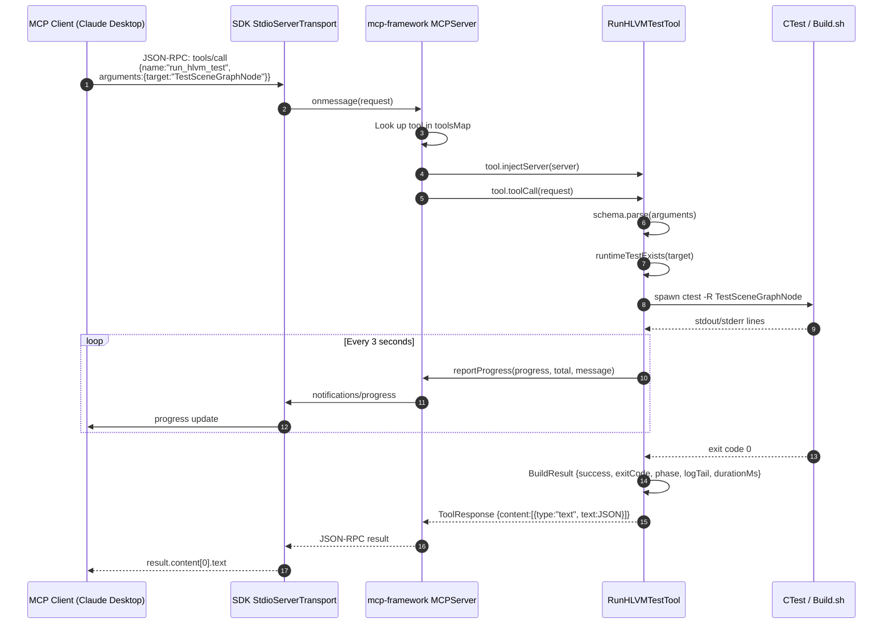

# HLVM Engine MCP Server — Architecture & Build Notes

## What it is

A local MCP (Model Context Protocol) server that exposes HLVM Engine's test runner to MCP clients such as Claude Desktop. The server speaks MCP over stdio and currently provides three tools:

- `list_hlvm_tests` — discover Runtime tests registered with CTest.
- `run_hlvm_test` — build and run a single Runtime test.
- `run_hlvm_tests_by_module` — run a filtered set of Runtime tests.

## Why it exists

The engine already has a working test harness (`./Build.sh --Config=Debug --Target=<Name> --Test`). The MCP server makes that harness callable from an AI assistant without the assistant needing to know the exact shell invocation, working directory, or CTest details. It also gives structured results (exit code, phase, log tail, duration) back to the client.

## How it was built

### 1. Local MCP framework

The project uses the TypeScript MCP framework added as a Git submodule at `Engine/Source/Plugin/mcp-framework/`.

```bash
# After cloning the parent repo with --recurse-submodules, or:
git submodule update --init --recursive Engine/Source/Plugin/mcp-framework

cd Engine/Source/Plugin/mcp-framework
npm install      # triggers prepare -> npm run build -> dist/
```

Because the consumer links the framework via `file:../mcp-framework`, npm ends up with two `zod` instances:

- one inside `mcp-framework/node_modules/zod` (used by the framework's validators)
- one inside `hlvm-engine-mcp/node_modules/zod` (used if the consumer imports `z` from `"zod"`)

Schemas created with the consumer's `zod` fail the framework's `instanceof z.ZodObject` check, producing `Cannot read properties of null (reading 'type')`. The fix was to re-export `z` from the framework's barrel so the consumer uses the exact same instance:

```ts
// Engine/Source/Plugin/mcp-framework/src/index.ts
export { z } from 'zod';
```

Consumer tools then import:

```ts
import { MCPTool, z } from "mcp-framework";
```

### 2. Consumer project

Created `Engine/Source/Plugin/hlvm-engine-mcp/` with:

- `package.json` — ESM module, local `mcp-framework` dependency, peer deps `@modelcontextprotocol/sdk` and `zod`.
- `tsconfig.json` — matches the framework's `Node16` module resolution.
- `src/index.ts` — constructs `MCPServer()` and calls `start()`.
- `src/tools/*.ts` — three tools, each a default-exported class extending `MCPTool`.
- `src/utils/*.ts` — repo-root resolution, CTest parsing, build execution.
- `scripts/smoke.js` — manual stdio handshake test.

### 3. Tool discovery

`mcp-framework` auto-discovers tools from `dist/tools/*.js` (default exports only). There is no manual `server.registerTool()` call.

### 4. Test execution

`runHLVMTest` in `src/utils/build.ts` supports two paths:

- **Full path**: spawn repo-root `./Build.sh --Config=<cfg> --Test --Target=<name>`.
- **Fast path**: spawn `ctest -R <name> --output-on-failure` directly in the Runtime build directory when `skipBuild: true`.

Output is captured in a ring buffer (last 200 lines) and returned as `logTail`. Phase is inferred from output keywords (`configure`, `compile`, `test`). Progress notifications are monotonically increasing from 1 to 100.

## Logic chain of one MCP request

The following diagram shows the path from the client sending `tools/call` for `run_hlvm_test` to the result being returned.



## File map

```
Engine/Source/Plugin/hlvm-engine-mcp/
├── src/
│   ├── index.ts                    # MCPServer construction + start()
│   ├── tools/
│   │   ├── ListHLVMTestsTool.ts    # list_hlvm_tests
│   │   ├── RunHLVMTestTool.ts      # run_hlvm_test
│   │   └── RunHLVMTestsByModuleTool.ts  # run_hlvm_tests_by_module
│   └── utils/
│       ├── repoRoot.ts             # HLVM_REPO_ROOT / walk-up detection
│       ├── ctest.ts                # ctest -N parsing
│       └── build.ts                # Build.sh / ctest execution + progress
├── scripts/
│   └── smoke.js                    # stdio smoke test
├── package.json
├── tsconfig.json
├── README.md
└── ARCHITECTURE.md                 # this file
```

## Key design decisions

- **stdio transport**: chosen because Claude Desktop natively supports spawning a command and talking over stdin/stdout. No ports, no CORS, no OAuth.
- **Runtime-only in v1**: Common tests are registered in CTest but are not built as standalone executables (`Common/Binary/Debug/` only contains `libCommond.a`). Adding Common support requires CMake changes, deferred.
- `skipBuild: true`: exposed from day one so the test loop stays fast (~380 ms) after the first full build.
- **Ring-buffer log tail**: full build/test output can be hundreds of megabytes for rendering tests. Returning only the last 200 lines avoids blocking the child process and keeps the MCP response small.

## Build & verify

```bash
# Ensure the submodule is present
git submodule update --init --recursive Engine/Source/Plugin/mcp-framework

cd Engine/Source/Plugin/hlvm-engine-mcp
npm install
npm run build      # tsc + mcp-build validation
npm run smoke      # stdio handshake + list_hlvm_tests
```

## Known limitations

- Only Runtime tests are supported.
- Progress phase detection is heuristic based on log output.
- `run_hlvm_tests_by_module` runs tests sequentially to avoid GPU contention between rendering tests.
