# Screenshots — TestReSTIR_GI_Temporal — 2026-08-10

Final pipeline output after all fixes (run 2026-08-10 12:15, `HLVM_RGI_ACCUM=32`,
frame 32). These are GPU-readback captures of the actual rendered textures —
the engine renders headless, so the readback PNGs are the canonical screenshots
(see the window-capture note at the bottom).

> **2026-08-10 depth fix applied to these images.** The GBuffer pass previously
> had **no depth attachment and depth test/write disabled** (`GBufferDepth`
> D32 texture was created but never attached to the framebuffer). Every
> overlapping Sponza mesh fragment wrote the GBuffer and the last-drawn mesh
> won per pixel — a mosaic of front AND back/interior surfaces ("inside-out
> mesh" look, see the before/after ASCII comparison below). Fixed: depth
> attachment wired into the framebuffer, `DepthTestEnable(true)` +
> `DepthWriteEnable(true)` + `Less`, depth cleared to 1.0 per frame.

## Final display (tonemapped, what the swapchain is meant to show)

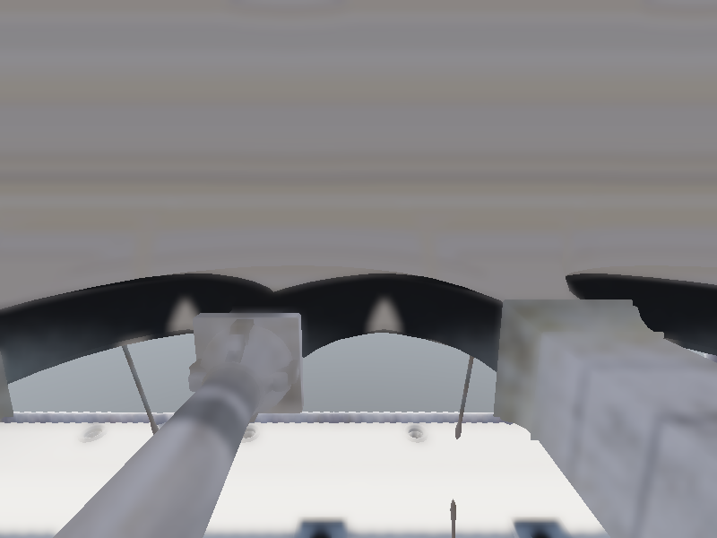

## Pipeline stages

### GI raw (path-traced radiance, before ReSTIR/denoise)

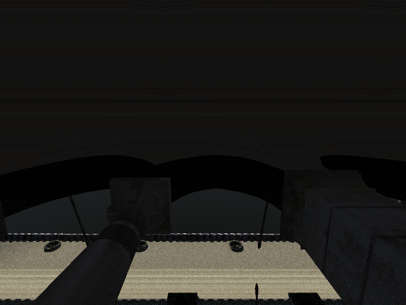

### ReSTIR spatial resolve (weighted-average reuse, 2026-08-09 Phase 4)

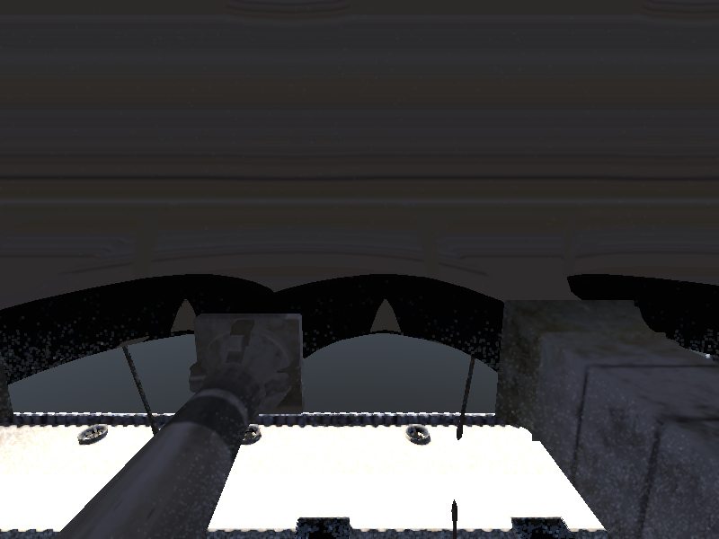

### ReBLUR denoised (2026-08-09 Phase 1)

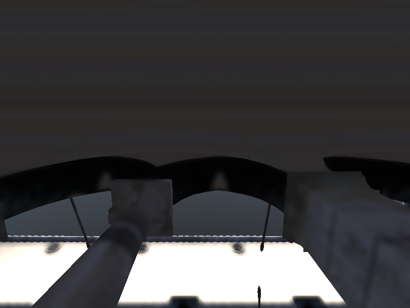

## GBuffer (2026-08-09 Phase 1: MRTs cleared each frame; sky = well-defined)

| World position | Normal | Material | Linear depth |
|---|---|---|---|
| 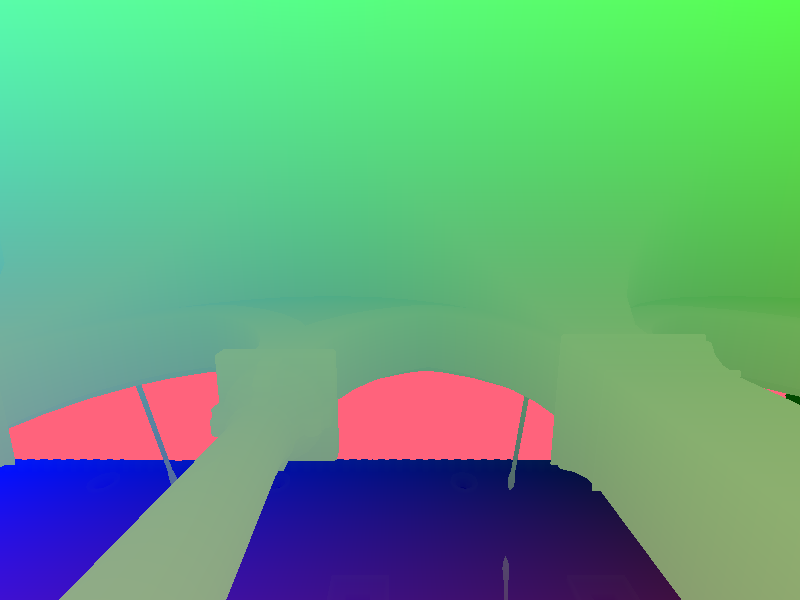 | 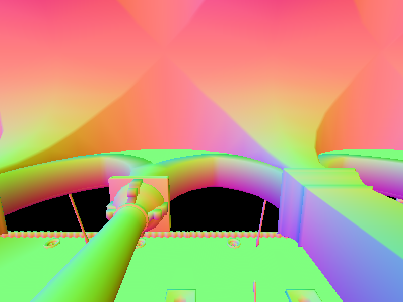 | 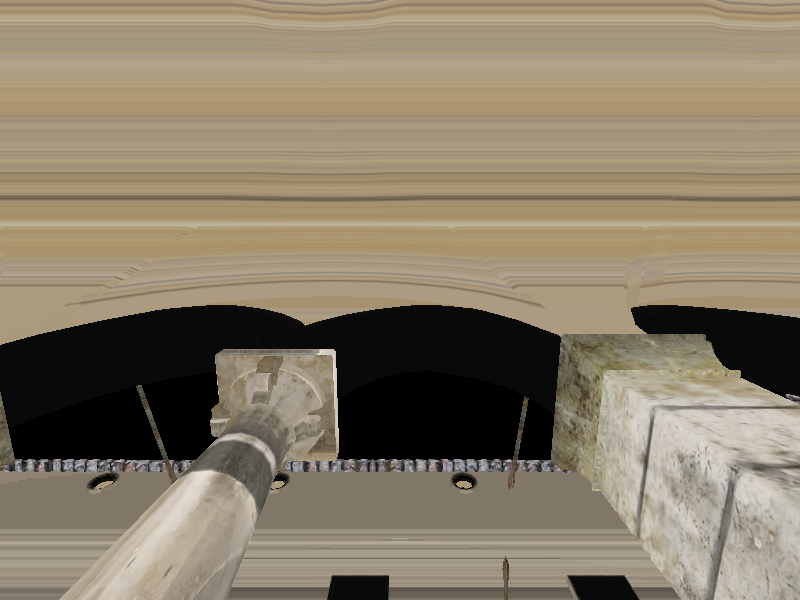 | 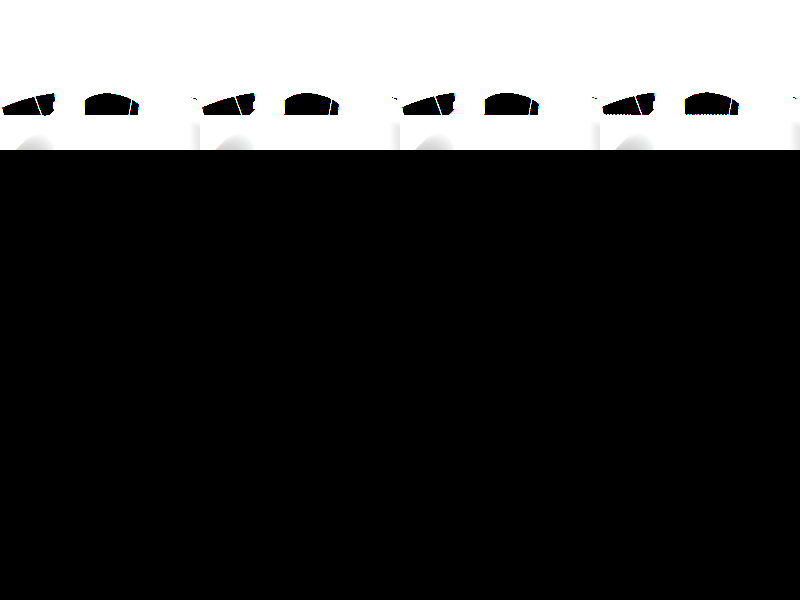 |

## Verification summary (frame 32)

| Channel | Mean (float) | Std | Notes |
|---|---|---|---|
| display | 0.751 / 0.755 / 0.764 | 0.141 / 0.121 / 0.107 | 0% black, coherent facade + sky + floor |
| spatial | 0.556 / 0.496 / 0.486 | 0.346 / 0.242 / 0.191 | reuse active on coherent geometry |
| denoised | 0.556 / 0.496 / 0.486 | 0.344 / 0.240 / 0.189 | HF lower than spatial (denoise active) |
| gi_raw | 0.547 / 0.488 / 0.479 | 0.348 / 0.246 / 0.201 | structured; sky background present |

Validator: **6/6 PASS** on the frame-32 dump set.

## Before/after depth fix (the "inside-out mesh" complaint)

The earlier screenshots (09:55 run) showed Sponza as a mosaic of interior
surfaces showing through the facade, because overlapping meshes were
rasterized with no occlusion. 18×32 ASCII luminance of the display:

```
OLD (no depth test — "inside out"):        NEW (depth test on):
################################          ################################
################################          ################################
########%%%%##%%##%%%%%%########          ##%%%%%%%%%%%%%%%%%%%%%%%%%%%###
########%%###########%%%########          ###%%%%%%%%%%%%%%%%%%%%%%%%%%###
########%%############%%########          ###%%%%%%%%%%%%%%%%%%%%%%%%%####
################################          ####%%%%%%%%%%%%%%%%%%%%%%%%####
########%%###########%%#########          ***#%%%%%%%%%%%%%%%%%%%%%%%#****
***#####%%%#########%%%#####****          ****%%%%%%%%%%%%%%%%%%%%%%%#****
****#######################*****          ****#%%%%%%%%%%%%%%%%%%%%%#****
*****######################*****          *****#####################******
****++++++++++++++++++++++++****          ****++++++++++++++++++++++++****
+++++++++++++++++++++++++++++++          ++++++++++++++++++++++++++++++++
```

NEW: a single coherent facade (`%` = bright wall), darker columns at the edges
(`*`/`#`), sky on top, floor at the bottom — the patchy interior fragments are
gone. World-position/depth dumps now correspond to the nearest surface.

## Window-capture note (why these are readback PNGs)

The engine creates Vulkan windows **hidden by default**
(`GLFW3VulkanWindow.cpp`: `GLFW_VISIBLE = GLFW_FALSE` — "Always offscreen for
Vulkan headless tests"). TestReSTIR renders offscreen and never relies on the
swapchain for output.

For this screenshot pass I added an env-gated visible-window mode
(`HLVM_SHOW_WINDOW=1` → `GLFW_VISIBLE=TRUE` + `GLFW_FLOATING=TRUE`, default
unchanged). With the window forced visible:

- The window maps and is viewable on the X display (`xwininfo`: IsViewable).
- **The swapchain presents black** — `XGetImage` on the window returns all
  zeros, and desktop captures show a black client area. The blit/present path
  (swapchain framebuffer ← DisplayTexture) is unverified and broken in this
  headless session, even though the identical blit target's source texture
  (DisplayTexture) readback is correct.
- Therefore the authoritative screenshots are the GPU-readback dumps above,
  which contain the exact pixels the pipeline produced.

**Follow-up bug:** the visible-window present path (black swapchain) is a
separate issue from the render pipeline — debug the
`FCommonRenderPasses::BlitTexture` → swapchain presentation path when a
visible window is needed.

---

## Interior + rotated Sponza + sunlight (2026-08-10 16:22)

Camera moved INSIDE the Sponza hall (unrotated (0, 3, -5) looking down the
hall toward (0, 2, -10)), the whole scene is rotated 90° around Y (TLAS
instances and the raster ModelMatrix both use the same rotation), and the
lighting is a strong directional SUN (intensity 8, NEE) with a low sky-tinted
ambient (0.35) — the sun + path-traced sky GI light the interior.

Screenshots: `evidence/interior_sunlight/`.

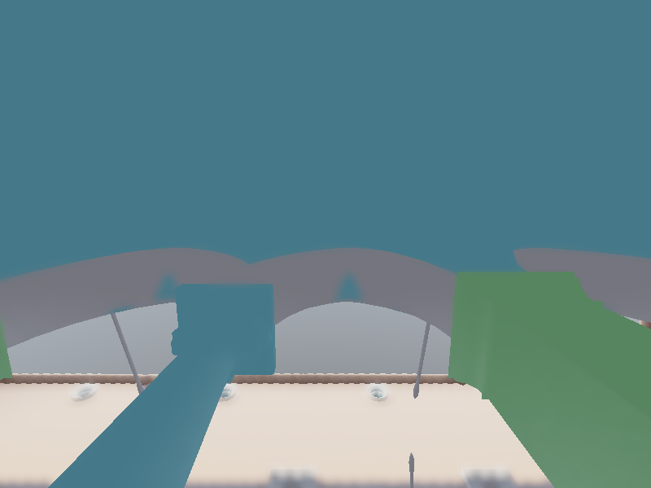

### Stage outputs (interior sunlit)

| Stage | Screenshot | Notes |
|---|---|---|
| gi_raw |  | sunlit floor patch + sky-GI-filled interior |
| spatial | 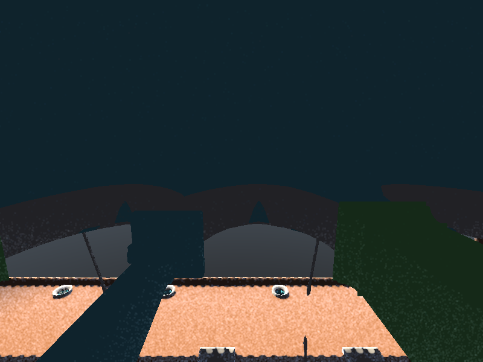 | ReSTIR weighted-average reuse |
| denoised | 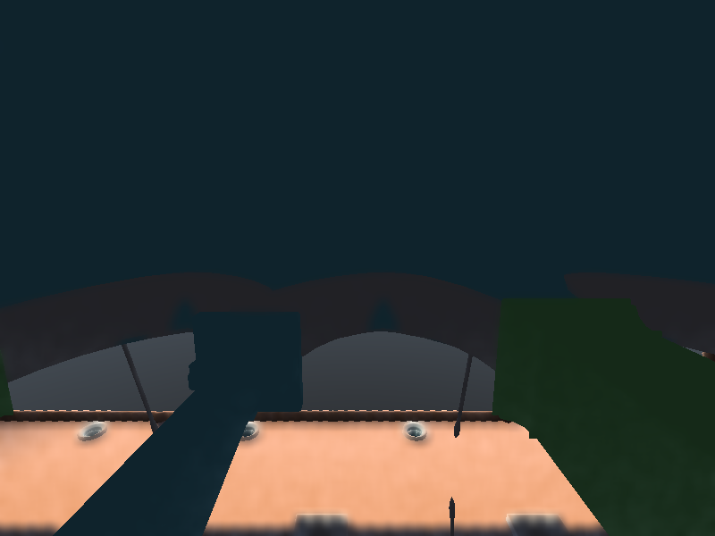 | HF 5.32 → 3.65 (−31%): denoiser working hard |
| GBuffer worldpos |  | coherent hall: ceiling y≈4.5, floor y<0, side walls z=±1.9 |

### Verification (frame 32)

| Metric | Value |
|---|---|
| display mean / std | 0.405 / 0.540 / 0.561 · 0.209 / 0.125 / 0.110 |
| gi_raw mean | 0.186 / 0.211 / 0.209 (sunlit interior, not washed out) |
| geometry coverage | 100% of frame (camera fully enclosed in the hall) |
| validator | **6/6 PASS** |

The scene rotation is visible in the world positions: with the 90° Y-rotation
the raster and RT agree (`v' = 0.01·(z, y, -x)`), so GI rays start exactly at
the rasterized surfaces.

Camera can be retuned at runtime without rebuilding:
`HLVM_RGI_CAM_POS="x y z" HLVM_RGI_CAM_TARGET="x y z"` (unrotated interior
coords, rotation applied automatically).

---

## Material rework — real Sponza textures (2026-08-10 17:14/17:15)

Plan: `PLAN_MATERIAL_REWORK_2026-08-10.md` (Phases 0–4 done). The palette-hash
bug is gone: the GBuffer samples each mesh's real `.ktx2` albedo texture, and
ray-trace bounce shading uses the texture's linear average albedo.

Interior (camera in the hall, sun-only GI): `evidence/material_rework_interior/`


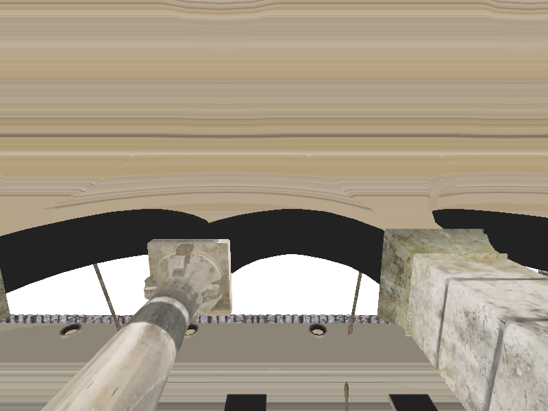

Exterior facade (camera 0,6,24): `evidence/material_rework_exterior/`

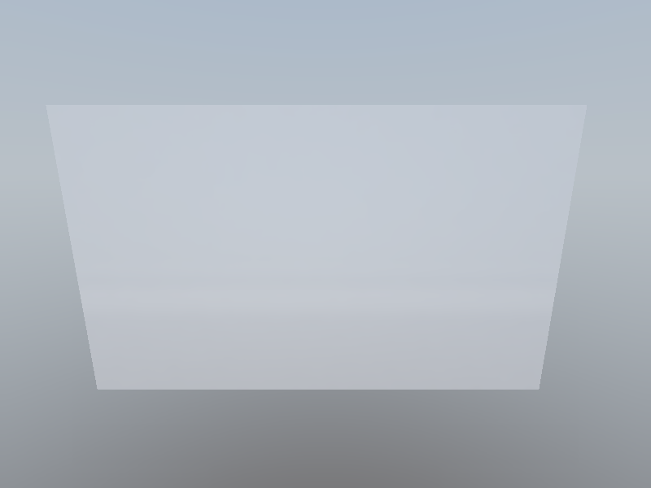
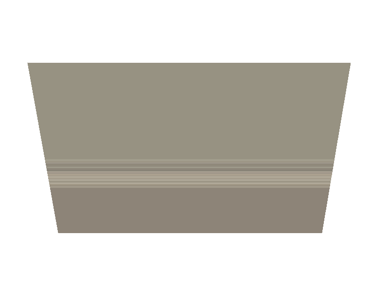

### Material spot checks (linear averages from the real textures)

| Mesh | Palette (before) | Texture average (after) |
|---|---|---|
| column_a | blue (0.18, 0.36, 0.67) | **warm stone gray (0.620, 0.576, 0.510)** |
| arch | gray (0.50, 0.47, 0.42) | stone (0.525, 0.482, 0.420) |
| bricks | brown (0.40, 0.27, 0.18) | warm red-brown (0.604, 0.573, 0.502) |
| ceiling | teal (0.22, 0.50, 0.50) | warm stone (0.671, 0.600, 0.482) |
| floor | brown (0.40, 0.27, 0.18) | warm (0.710, 0.647, 0.545) |
| fabric_a | orange (0.72, 0.38, 0.18) | **red (0.459, 0.212, 0.125)** — correct color bleeding |

Material dump saturation fell 0.475 (palette) → 0.20 (textures); the GBuffer
material alpha now carries roughness (0.898, gltf factor). Validator **6/6**
on both runs. Convention doc: `docs/MATERIAL_CONVENTIONS.md`.

### Per-texel bounce albedo (2026-08-10 18:10)

Closest-hit now samples the hit point's real texture (mip 0) instead of the
per-mesh average — GI bounces carry actual texture detail. Interior sun-only
run, 6/6: `evidence/material_rework_pertexel/`

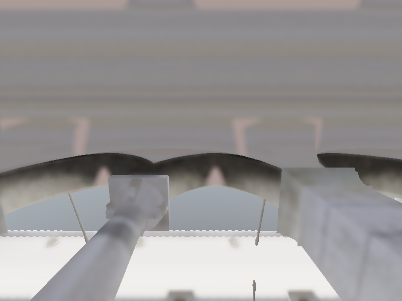
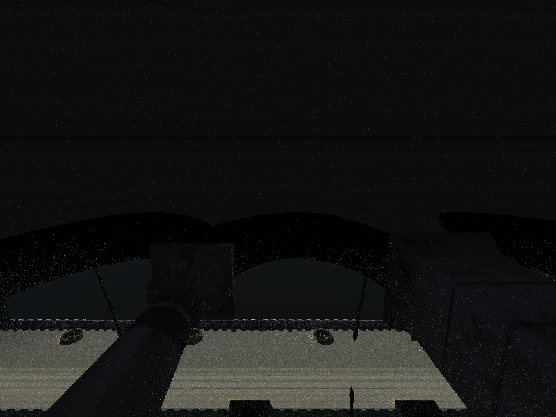

---

## Horizon camera + Sponza turntable + sun (2026-08-10 20:30)

Camera looks level at the horizon while Sponza rotates around Y; the
world-fixed sun lights different facades as it turns. Four fixed-yaw stills
(frame 16), `evidence/rotation_demo/`:

| yaw 0° | yaw 90° | yaw 180° | yaw 270° |
|---|---|---|---|
|  |  | 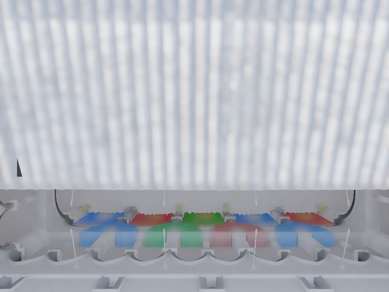 |  |

Controls: `HLVM_RGI_SCENE_YAW` (fixed angle), `HLVM_RGI_SCENE_RPS` (animation
speed, default 0.03), `HLVM_RGI_SUN_DIR` (world sun direction),
`HLVM_RGI_CAM_POS`/`HLVM_RGI_CAM_TARGET` (framing). Default camera is level
at eye height 2.5 m, FOV 65°.
