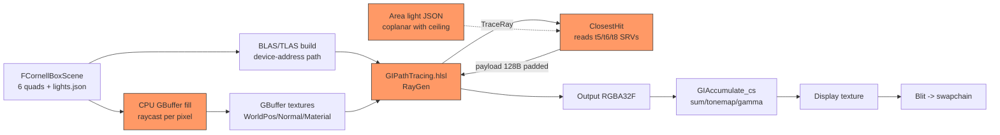
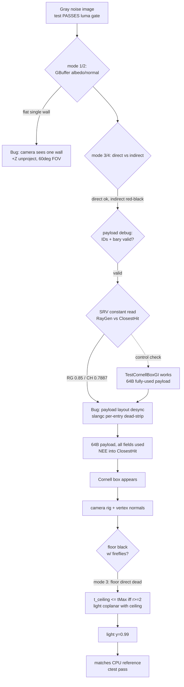

# TestPathTraceGI: Cornell Box Not Rendering — Full Debugging Retrospective

**Date:** 2026-07-19
**Symptom:** `TestPathTraceGI` "passed" its luminance gate (mean luma 0.48 > 0.01) but the rendered
image was a uniform gray-brown noise field. No Cornell box anywhere.
**Outcome:** 4 root causes found and fixed; test now renders a correct path-traced Cornell box;
CPU reference render added as a permanent scene validator.

---

## 1. The Logic Chain (and where it was broken)

The test has a long pipeline. Every arrow is a place a bug can hide:



The four orange nodes are where the bugs actually were:

| # | Bug | Symptom it produced |
|---|-----|---------------------|
| 1 | **RT payload layout desync** (slangc dead-strips per-entry) | indirect GI = red/black noise, garbage normals/albedos |
| 2 | **Camera**: box center + 60° FOV + `+Z` unproject | frame = one flat wall, no box structure |
| 3 | **CPU GBuffer normals from cross-product** | side walls got outward normals |
| 4 | **Area light coplanar with ceiling** | floor black with white fireflies |

Crucially, bugs 2–4 were *invisible* until bug 1 was fixed — the image was too broken to see them.
Fix order matters: get signal first, then polish.

---

## 2. Mindset: the rules I worked by

1. **Trust measurements, not code reading.** I "proved" the shader math correct on paper twice.
   It was still broken. Only instrumented dumps moved the investigation forward.
2. **Bisect the chain with debug visualizations.** The shader already had `HLVM_PT_DEBUG_MODE`
   (albedo/normal/direct/indirect). Each mode amputates a stage of the chain — one run tells you
   which side of the cut the bug lives on.
3. **One variable per experiment.** New payload fields OR new debug modes, never both blind.
   Rebuild shaders only (~0.6 s with slangc) — experiments were cheap, so I ran many.
4. **Keep a known-good control.** `TestCornellBoxGI` uses the *same* binding pattern and worked.
   That single fact eliminated the driver, nvrhi, slangc, and the whole binding layer as suspects.
5. **Use constant/sentinel data to separate "data wrong" from "transport wrong".** A constant
   write inside ClosestHit (`RTInstanceInfo[0].AlbedoColor`) vs the same read in RayGen was the
   decisive experiment of the whole session.
6. **Validate everything outside the suspect system.** The CPU reference render checks scene,
   camera, materials and light with zero GPU RT. If it disagrees with the GPU, the scene is
   innocent and the GPU chain is guilty.
7. **Write down every dead end.** Each falsified hypothesis shrinks the search space.
   A dead end is progress, not failure.

---

## 3. Hypothesis Mindmap (with verdicts)

```mermaid
mindmap
  root((Gray noise<br/>no Cornell box))
    Scene/Camera
      Camera at box center + 60deg FOV
        CONFIRMED - albedo dump flat 0.847, normal dump flat (0,0,-1)
      CPU ray-gen +Z instead of -Z
        CONFIRMED - saw FRONT wall behind camera
      Side-wall winding flipped
      Light JSON struct mismatch
        FALSIFIED - C++ vs HLSL FLight layouts identical
    Bindings/Runtime
      Register shift mismatch b/t/s/u
        FALSIFIED - spirv-reflect: bindings exactly as declared
      nvrhi BLAS offsets bytes vs elements
        FALSIFIED - vulkan-raytracing.cpp uses byte addresses
      InstanceIndex vs InstanceID semantics
        FALSIFIED - InstanceIndex = build-order index, correct
      Buffer content garbage
        FALSIFIED - AS build (device address) + RayGen SRV reads both perfect
      Descriptor type mismatch
        FALSIFIED - all StructuredBuffers STORAGE_BUFFER, usage flags ok
    Shader logic
      NEE/MIS math errors
        FALSIFIED - paper-check + CPU reference uses same math, works
      Payload layout desync slangc
        CONFIRMED - CH constant read 0.7887 vs RG 0.85
    Light setup
      Light coplanar with ceiling
        CONFIRMED - floor direct black w/ fireflies, tMax margin analysis
```

---

## 4. Investigation Timeline (what actually happened)

### Step 0 — Baseline: the test lies to you
`TestPathTraceGI` reported **PASS** with `mean luminance 0.4833`. The dumped images:
`Output_frame0001.png` = dense white noise; `Display_frame0016.png` = near-black red noise.
Lesson: a scalar gate (mean luma) cannot detect "image is garbage". Any image-test without a
structural check (or at least a human look at a dump) is a weak test.

### Step 1 — Debug modes 0–4: amputate the chain
Ran the stock binary with `HLVM_DUMP_PTGI=1 HLVM_PT_DEBUG_MODE=N`:

| Mode | Shows | Result | Conclusion |
|------|-------|--------|-----------|
| 1 albedo | GBuffer albedo | **perfectly flat 0.8471** | every pixel sees the SAME white wall |
| 2 normal | GBuffer normal | **perfectly flat (0.498,0.498,0)** | every normal = (0,0,-1), the FRONT wall |
| 3 direct | primary NEE | noisy but lit, gradient | direct lighting works |
| 4 indirect | bounce GI | **near-black, red-tinted** | bounce chain broken |

Two independent bugs already visible: camera sees one wall (bug 2), bounce GI is garbage (bug 1).
The red tint ratio (0.058, 0.008, 0.009) ≈ red-wall albedo (0.8, 0.1, 0.1) was a red herring that
sent me toward instance/albedo confusion first — worth noting: **ratios can frame the wrong suspect**.

### Step 2 — Dead-end sweep (all falsified quickly)
- FLight C++ vs HLSL: identical 80-byte layouts. ✗
- `InstanceID`/`instanceCustomIndex` semantics in nvrhi: `InstanceIndex()` = build order, fine. ✗
- BLAS `vertexOffset`/`indexOffset` units: nvrhi vulkan backend uses **byte** addresses; test passes bytes. ✗
- Register shifts (the AGENTS.md `constantBufferOffset` gotcha): `FBindingLayoutBuilder` consistent;
  `spirv-reflect` on the sblob shows t5/t6/t8 = bindings 5/6/8, STORAGE_BUFFER, names intact. ✗
- Vulkan/NVRHI validation layers: **zero errors in logs**. ✗

### Step 3 — Instrument the payload boundary (modes 6–12)
Added debug fields to the payload (instance/primitive IDs, barycentrics) and debug modes to dump them:

| Mode | Dumps | Result |
|------|-------|--------|
| 10 | `InstanceIndex/PrimitiveIndex` | **VALID** (0–5 / 0–1) |
| 12 | barycentrics | **VALID** ([0,1], mean ≈ 1/3) |
| 9 | `RTInstanceInfo[id].AlbedoColor` | **GARBAGE** (59% black) |
| 6/7 | vertex/geo normals | **GARBAGE** with a smooth gradient |

Hardware intersection works (IDs, barycentrics), but every `StructuredBuffer` read *inside
ClosestHit* is garbage. Two remaining suspects: the SRV descriptors, or the payload transport.

### Step 4 — The decisive experiment: constant sentinel reads
- Mode 13: RayGen reads `RTInstanceInfo[0].AlbedoColor` → **0.85 exactly** ✓
- Mode 14: RayGen reads `RTVertices[0].Position` → **(-1,-1,1) exactly** ✓
- Mode 6 rewritten: ClosestHit writes the *same constant* `RTInstanceInfo[0].AlbedoColor` into the
  payload → arrives as **0.7887, constant everywhere** ✗

Same buffer, same binding set, same pipeline: RayGen reads perfectly, ClosestHit's data arrives
corrupted. Descriptors are shared and correct — so **the corruption is at the payload boundary**.

### Step 5 — The control: TestCornellBoxGI still works
Ran the older test (same binding builder, same shader structure, **64-byte fully-used payload**)
→ renders a perfect Cornell box *right now*. Driver, nvrhi, slangc, bindings: all innocent.
The only structural difference left: **the payload**.

### Step 6 — Root cause #1: slangc payload dead-stripping
The old `GIPayload` was 128 bytes: padded fields nobody reads, debug fields only RayGen reads,
`hitNormal` written by ClosestHit read by RayGen. slangc compiles each `[shader(...)]` entry
independently and can dead-strip payload fields an entry never touches; if stripping differs
between entries, the two sides disagree on offsets — exactly the observed "valid IDs/barycentrics,
garbage everything-else".

**Fix:** restructure to the proven shape — compact 64-byte payload, every field written+read on
both sides, all fields initialized in RayGen, and **bounce NEE moved into ClosestHit** (the valid
hit normal only exists there; this also removes `hitNormal` from the payload entirely).

Immediately after this fix, the Cornell box appeared in the dumps.

### Step 7 — Now the camera bugs are visible
With signal restored: mode 1/2 still flat → camera at box center + 60° FOV really does see one
wall (FOV geometry: from the center of a 2×2×2 box you need ~74°+ to catch the side walls).
And the CPU ray-gen unprojected with `z=+1` (behind the intended view direction) — it was showing
the FRONT wall. Fixed with a shared `GetCameraRig()` (near front wall, FOV 90°) and a correct
`-Z` unprojection used by view constants, GBuffer fill, and the CPU reference.
Also fixed CPU GBuffer normals to use mesh vertex normals (side walls' winding gives outward
cross-product normals); then rewound the side walls in `FCornellBoxScene` so geometric == vertex normal.

### Step 8 — Root cause #4: the floor that its own light occludes
After the camera fix: floor black with sparse white fireflies. Mode 3 showed floor *direct* broken.
Analysis:

- The area light covers the whole ceiling and sits **exactly on the ceiling plane** (y=1.0).
- Shadow-ray origins are offset along the surface normal (`+Y` for the floor) by 1 mm.
- Ceiling-plane hit distance from a floor point: `t = (2 - 0.001)/L.y`; `tMax = r - 0.001`.
- Occluded iff `t <= tMax` ⟺ `r >= 2` — **true for every floor point** (box is exactly 2 tall).
- Only FP-coin-flip pixels survive → white fireflies.

The CPU reference survived by luck: its shadow margin is 2 mm vs the GPU's 1 mm.
**Fix:** drop the light 1 cm below the ceiling (`y = 0.99` in `CornellBox_Lights.json`).
Classic rule: never leave an area light exactly coplanar with occluding geometry.

### Step 9 — Polish and verify
- Disabled the fake constant ambient for the closed box (`Desc.AmbientScale = 0`, new
  `FGIPassDesc` override); exposure default back to 1.0.
- Made dead `Desc.EnableRR`/`RussianRoulette` fields authoritative (test-only user).
- CPU reference + GPU result now agree structurally: bright floor, gradient back wall,
  red/green walls, GI color-bleeding on the ceiling. 128-frame accumulation is clean and
  converged. `ctest -R TestPathTraceGI` **Passed**.

---

## 5. Decision Flow (how each run cut the search space)



---

## 6. What went wrong (root causes, precisely)

1. **Payload contract violated the compiler's rules.**
   `GIPayload` carried padding + debug-only fields. slangc compiles RT entry points independently
   and may eliminate payload fields an entry never uses; asymmetric elimination desyncs the
   raygen/closesthit layout. Every closesthit→raygen value arrived shifted/garbage.
   *This is the class of bug that code review almost never catches — the shader "looks" fine.*

2. **Camera never framed the scene.** Box-center camera + 60° FOV geometrically cannot see the
   side walls; plus the CPU ray-gen unprojected toward `+Z` (behind the intended view), so the
   one visible wall was the *front* wall — the GBuffer normals debug mode proved it: `(0,0,-1)`.

3. **CPU GBuffer normals from cross-products.** Two side walls are wound so their geometric
   normal points *out* of the box; the CPU raycast used `cross()` while the rest of the engine
   uses vertex normals. Would have poisoned bounce directions for side-wall pixels.

4. **Light coplanar with occluder.** A ceiling-sized area light *on* the ceiling plane makes the
   ceiling triangle a systematic occluder for its own light whenever the surface-normal offset
   points toward the plane and `r >= 2` holds. The floor lost all direct light except FP-lucky pixels.

Process mistakes worth admitting:

- **A mean-luminance gate let a garbage image "pass" for days.** The dump review should have been
  part of the test from day one (now it is: dumps + CPU reference + structural sanity via debug modes).
- **The red-tint ratio was a seductive clue** — it matched the red wall's albedo and pulled the
  investigation toward instance/albedo confusion for a round before the payload sentinel experiment
  reframed it. Correlation with a plausible object is not causation.
- **The exposure=0.3 workaround masked the severity.** "White noise" was treated as a tonemapping
  problem earlier; it was actually a data-corruption problem. Workarounds that hide symptoms delay
  root-cause fixes.

---

## 7. How it was fixed (change list)

| File | Change |
|------|--------|
| `Private/Renderer/Shader/GI/GIPathTracing.hlsl` | 64-byte fully-used payload; all fields initialized; bounce NEE moved into ClosestHit; debug modes reduced to raygen-local (1–5, 13/14) |
| `Private/Renderer/GI/FGIPass.cpp` | `maxPayloadSize` 64; `AmbientScale`/`EnableRR`/`RussianRoulette` now honored from `FGIPassDesc` |
| `Public/Renderer/GI/FGIPass.h` | new `FGIPassDesc::AmbientScale` (<0 = CVar) |
| `Public/Renderer/Scene3D/FCornellBoxScene.h` | side walls rewound so geometric normal == vertex normal |
| `Test/TestPathTraceGI.cpp` | shared `GetCameraRig()` (0,0,0.9 → -Z, FOV 90); correct `-Z` unproject; CPU GBuffer uses vertex normals + fills once; `RenderCPUReferenceAndDump()` (traditional render: primary + stratified light sampling + CPU shadow rays); `AmbientScale=0`; exposure default 1.0 |
| `Test/TestPathTraceGI_Data/CornellBox_Lights.json` | light `y: 1.0 → 0.99` (off the ceiling plane) |
| `AGENTS.md` | two new gotchas: slangc payload rules; area-light-coplanar rule |

---

## 8. Reusable checklist for "RT image is garbage"

1. Dump intermediate textures (albedo/normal/direct/indirect) — pick the debug mode that amputates
   the chain at each stage. Flat albedo/normal ⇒ camera/GBuffer, not the tracer.
2. Verify hardware hits first (instance/primitive IDs, barycentrics) before blaming data.
3. Constant-sentinel reads on both sides of any shader boundary (payload, push constants, CBs).
4. Run a known-good sibling as the control before suspecting the driver/framework.
5. Build a CPU reference for everything outside the suspect system (scene, camera, light).
6. Check the *margins*: tMax/tMin epsilons vs coplanar geometry — fireflies-on-black usually means
   self-occlusion by a hair, not missing light.
7. Remove workarounds (exposure clamps, ambient terms) before concluding — they hide the shape
   of the failure.
8. When the image-test gate is scalar (mean luma), distrust "PASS" until a human sees the image.
